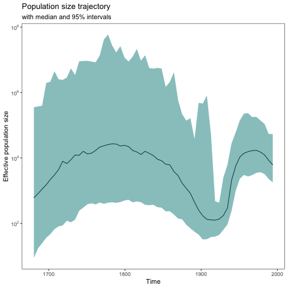

# skyplotr

[](https://www.gnu.org/licenses/gpl-3.0)

### Overview

**skyplotr** is an R package providing functions for plotting the population size trajectory across time. The plots created by **skyplotr** are ggplot objects, which means that after a plot is created it can be further customized using various functions from the **ggplot2** package.

### Installation

* Install latest development version from GitHub (requires [devtools](https://github.com/hadley/devtools) package):

```r
devtools::install_github("4ment/skyplotr")
```

### Example

`HCV.tsv` contains 1000 MCMC samples obtained from BEAST. This analysis involves a nucleotide alignment of Hepatitis C Virus (HCV), utilizing the piecewise-constant coalescent model. This model comprises 75 epochs with a cutoff set at 400.

```r
library(dplyr)
library(ggplot2)
library(skyplotr)

samples <- read.csv("data-raw/HCV-skygrid.tsv", sep = "\t")

root_height <- samples$treeModel.rootHeight
log_pop_size <- select(samples, starts_with("skygrid.logPopSize"))
cutoff <- samples$skygrid.cutOff[1]
skygrid <- prepare_skygrid(root_height, log_pop_size, cutoff, age_of_youngest=1994)
skygrid <-  mutate_at(skygrid, c("pop_size", "pop_size_low", "pop_size_high"), exp)

plot_title <- ggtitle("Population size trajectory",
                      "with median and 95% intervals")

skyplot(skygrid, fill="darkcyan") + plot_title
```

